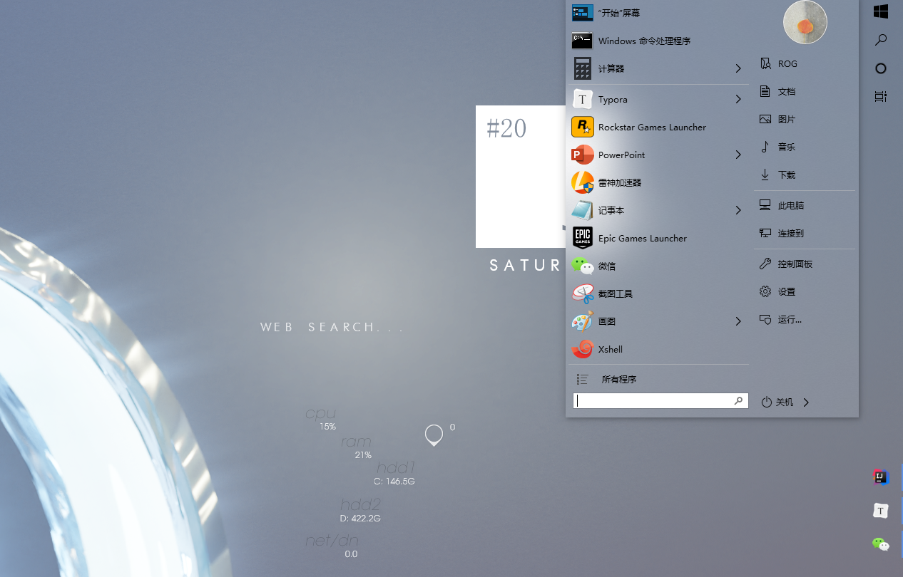
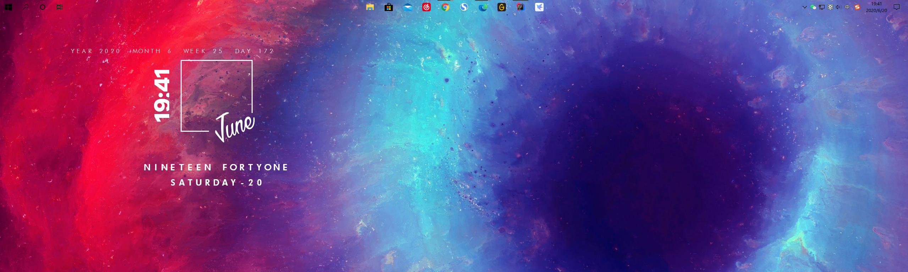

# Windows Desktop beautification
这是一篇关于Windows桌面美化的博客。想不想让你的windows 10系统也和Mac一样拥有快捷Dock栏，界面清爽而又简洁高效呢？:stuck_out_tongue_closed_eyes:
## 1. Demo
这是我的桌面：:sunglasses::two_hearts:

透明的任务栏，居中的应用程序，便捷Dock栏，桌面日期、时间等温馨小插件，是不是看一眼觉得工作效率都提高了:joy:，扶我起来写代码，我还能再战500年:muscle:

美化的工具大多都很轻量，也较易使用，花点心思打造专属自己的艺术桌面吧~:heartbeat:

## 2. Tools
工具篇。这里介绍桌面美化所需的一些工具和组件，以及美化的使用方法

### 1. 任务栏透明插件
任务栏透明插件有两种，这里比较推荐使用TranslucentTB，安装启动后设置一下你想要的效果就可以了
- TranslucentTB
官方GitHub：https://github.com/TranslucentTB/TranslucentTB
可以直接下载release使用：https://github.com/TranslucentTB/TranslucentTB/releases
Microsoft Windows 10商店也有哦~:kissing_heart:（免费）
- StartlsBack++
还有一个插件是StartlsBack++，官方网址：http://www.startisback.com/
在发现TranslucentTB之前一直使用的插件。不过软件收费，可以将windows 10的开始菜单变为经典的windows 7甚至xp样式（其实我还挺喜欢的），不过设置项稍多，使用方便程度不如TranslucentTB。看个人喜好啦:sparkling_heart:（温馨提醒，如需使用，请百度搜索，你懂的~）
*windows菜单效果图（windows 7开始菜单附毛玻璃效果）*

依然windows 10扁平风，爱了爱了

### 2. 任务栏icon居中插件

图示的居中美学确实让人第一眼感到非常惊艳:heart_eyes:，那么如何让任务栏上的icon居中呢？
- TaskbarX
官方介绍：Center your Windows 10 taskbar icons
官方GitHub：https://github.com/ChrisAnd1998/TaskbarX
下载地址：https://chrisandriessen.nl/taskbarx
Microsoft Windows 10商店也可购买付费版，自动更新只要￥8:kissing_heart:，支持一波血赚不亏~:joy:
安装启动任务栏icon即可自动居中，个性设置请参考作者官方文档介绍

### 未完待续...
